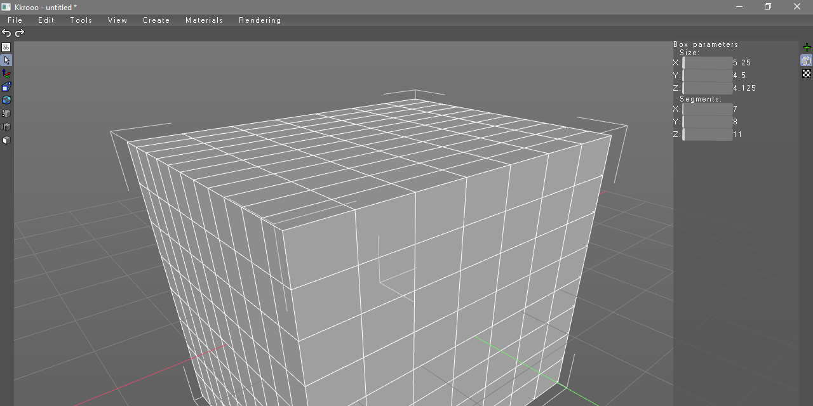

# kkrooo
3D Editor... with rendering... and plugins...

## DEMO

Check last release.

## Goals

* Mesh editing (vertex weld, face extrude and other)
* UV Editor
* Texture baking
* Object cloning
* Fast material creating
* Creating material from plugins
* Save scene file / load from file
* Undo-Redo

## Goals for the future

* Skeletal animation
* Scripts
* Smooth select
* Cursor teleporter
* Render plugin settings
* actually I have huge list of this goals...

## Contributing

artembasov@outlook.com

# Big thanks:

* FreeImage http://freeimage.sourceforge.net/
* gl3w https://github.com/skaslev/gl3w
* Rastertek tutorials http://rastertek.com/
* zstd https://github.com/facebook/zstd
* assimp https://github.com/assimp/assimp 